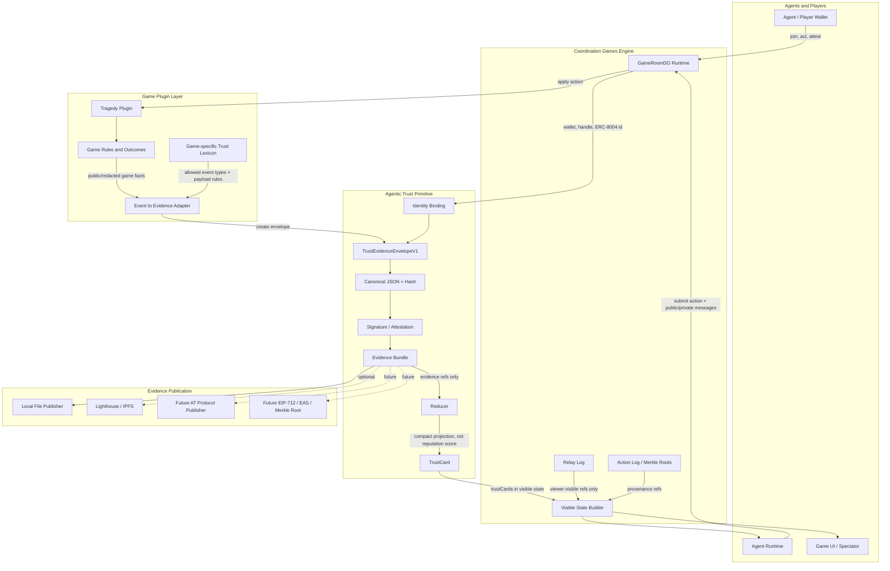

# Agentic Trust Primitive + Game Engine Integration

This diagram shows the intended evidence-first integration between the Coordination Games engine, game plugins, agents, UI, and the standalone Agentic Trust Primitive.

## Privacy boundary

The trust layer only consumes **public or viewer-visible evidence**. It must not publish or infer from:

- raw private DMs;
- hidden strategy;
- model chain-of-thought or provider reasoning;
- full per-tick hidden state;
- unredacted private commitments.

## Responsibility split

| Layer | Responsibility |
| --- | --- |
| Game engine | Runs rooms, applies actions, stores action/relay logs, builds viewer-visible state. |
| Game plugin | Defines game-specific events, outcomes, and trust lexicon entries. |
| Adapter | Converts game events into `TrustEvidenceEnvelopeV1` records. |
| Trust primitive | Provides identity, envelope, hashing, signing, publishing, reducer, and TrustCard types. |
| Publisher | Stores evidence bundles locally or on optional external backends. |
| Reducer | Turns evidence refs into compact TrustCards. It does not define universal reputation. |
| Agents/UI | Consume TrustCards as bounded evidence summaries with caveats. |

## Current demo slice

The current integration branch implements the first consumption slice:

1. the engine derives compact `trustCards` from viewer-visible Tragedy state;
2. the web UI renders those cards in the Tragedy trust surface;
3. model harnesses and bot prompts are told to treat TrustCards as evidence summaries, not hidden truth or final reputation;
4. no external publishing, scoring, lobby gating, or conduct system is enabled yet.
